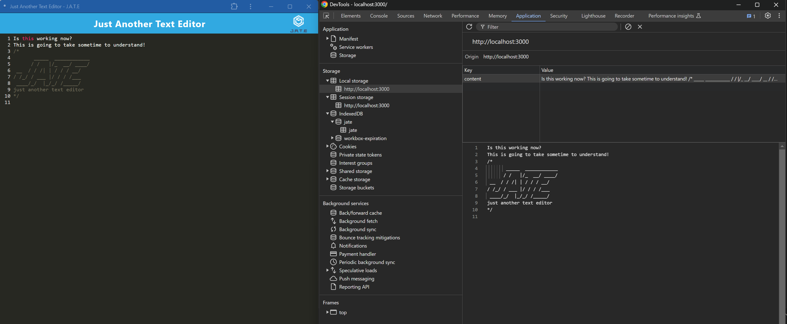

  # Text-Editor-PWA
  [](./LICENSE)

  ## Description
  This is my 19th challenge. In this challenge I was given starter code and was addressed with the task of implementing these features:
  * Uses IndexedDB to create an object store and includes both GET and PUT methods 
  * The application works without an internet connection Automatically saves content inside the text editor when the DOM window is unfocused. 
  * Bundled with webpack Create a service worker with workbox that Caches static assets.
  * The application should use babel in order to use async / await Application must have a generated manifest.json using the WebpackPwaManifest plug-in 
  * Can be installed as a Progressive Web Application

  ## Table of Contents 
  * [Installation](#installation)
  * [Usage](#usage)
  * [License](#license)
  * [Contributing](#contributing)
  * [Tests](#tests)
  * [Questions](#questions)

  ## Installation
  To install necessary dependencies, run the following command:
  ```
  npm i
  ```
  ## Usage
  *** **[Click Here - For Deployed Application](https://text-editor-pwa-ryc4.onrender.com)** ***

To use this application, you can just start typing. It will automatically save what you type. You can also install this application as a PWA and use it offline and your changes will still be saved.



  ## License
  This project is licensed under the **[MIT](./LICENSE)** license.

  ## Contributing
  N/A

  ## Tests
  To run tests, run the following command:
  ```    
  N/A
  ```
  ## Questions
  If you have any questions about the repo, open an issue or contact me directly at **rhinosstuff@gmail.com**.
  
  You can explore my other projects on GitHub **[rhinosstuff](https://github.com/rhinosstuff)**.
  
  